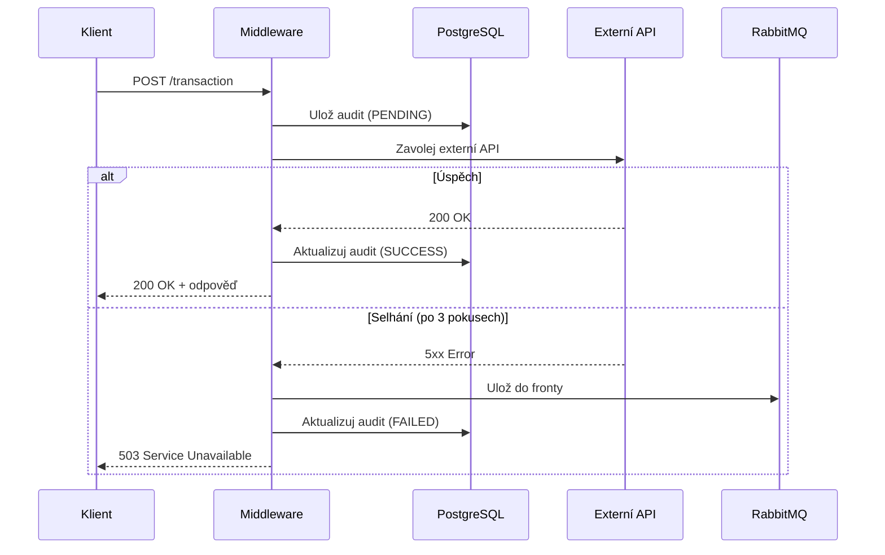

# Dokumentace projektu Integrační Middleware

## Přehled projektu

**Integrační Middleware (API Connector)** je reaktivní aplikace postavená na **Spring Boot 3.5.8** s využitím stacku **WebFlux**. Slouží jako prostředník mezi interními systémy a externími API, zajišťuje robustní komunikaci s automatickým retry mechanismem, fallback logikou přes RabbitMQ a auditním logováním do databáze.

---

## Technologický stack

| Technologie | Verze | Popis |
|-------------|-------|-------|
| **Java** | 21 | Programovací jazyk |
| **Spring Boot** | 3.5.8 | Framework |
| **WebFlux** | - | Reaktivní programování (neblokující I/O) |
| **Spring Security** | - | Zabezpečení (API Key autentizace), OAuth2 Client |
| **R2DBC + PostgreSQL** | - | Reaktivní přístup k databázi |
| **RabbitMQ** | 3.x | Message broker pro fallback |
| **ShedLock** | 5.13.0 | Distribuované zamykání plánovaných úloh |
| **Prometheus + Grafana** | - | Monitoring a vizualizace metrik |
| **Lombok** | - | Redukce boilerplate kódu |
| **SpringDoc OpenAPI** | 2.8.15 | Swagger UI dokumentace |
| **Maven** | - | Build nástroj |
| **Docker** | - | Kontejnerizace |

---

## Architektura

```
┌─────────────────┐         ┌──────────────────────┐         ┌─────────────────┐
│  Interní systém │ ──────▶ │ Middleware (WebFlux) │ ──────▶ │   Externí API   │
└─────────────────┘         └──────────────────────┘         └─────────────────┘
                                      │
                                      │ (při selhání)
                                      ▼
                            ┌──────────────────────┐
                            │     RabbitMQ         │
                            │ (záložní fronta)     │
                            └──────────────────────┘
                                      │
                                      ▼
                            ┌──────────────────────┐
                            │     PostgreSQL       │
                            │   (Audit záznamy)    │
                            └──────────────────────┘
```

---

## Struktura projektu

```
IntegracniMiddleware/
├── src/main/java/krematos/
│   ├── Main.java                          # Vstupní bod aplikace
│   ├── config/
│   │   ├── OpenApiConfig.java             # Konfigurace Swagger UI
│   │   ├── RabbitMQConfig.java            # Konfigurace RabbitMQ
│   │   ├── SchedulerConfig.java           # Konfigurace ShedLock
│   │   └── WebClientConfig.java           # Konfigurace WebClient a OAuth2
│   ├── connector/
│   │   ├── ExternalSystemConnector.java   # Volání externího API
│   │   ├── ExternalApiException.java      # Vlastní výjimka
│   │   └── FailedTransactionRescuer.java  # Záchrana zaseklých transakcí
│   ├── consumer/
│   │   └── FailedTransactionConsumer.java # Zpracování neúspěšných transakcí
│   ├── controller/
│   │   ├── MiddlewareController.java      # REST API endpoint
│   │   └── GlobalExceptionHandler.java    # Globální handler výjimek
│   ├── model/
│   │   ├── AuditStatus.java               # Enum stavu auditu
│   │   ├── InternalRequest.java           # DTO pro příchozí požadavek
│   │   ├── InternalResponse.java          # DTO pro odpověď
│   │   ├── ExternalApiRequest.java        # DTO pro externí API požadavek
│   │   ├── ExternalApiResponse.java       # DTO pro externí API odpověď
│   │   └── TransactionAudit.java          # Entita pro audit transakce
│   ├── repository/
│   │   └── TransactionRepository.java     # R2DBC repository
│   ├── scheduler/
│   │   └── TransactionCleanupSchedular.java # Plánovaný úklid starých záznamů
│   ├── security/
│   │   └── SecurityConfig.java            # Konfigurace zabezpečení
│   └── service/
│       └── TransactionService.java        # Hlavní business logika
├── src/main/resources/
│   ├── application.yml                    # Konfigurace aplikace
│   └── schema.sql                         # SQL schéma databáze
├── Dockerfile                             # Docker image definice
├── docker-compose.yml                     # Multi-kontejnerové nasazení
├── prometheus.yml                         # Konfigurace Prometheus
└── pom.xml                                # Maven závislosti
```

---

## API Dokumentace

### Endpoint: Zpracování transakce

| Atribut | Hodnota |
|---------|---------|
| **URL** | `POST /api/middleware/v1/transaction` |
| **Content-Type** | `application/json` |
| **Autorizace** | Header `X-API-KEY` |

#### Ukázka požadavku

```json
{
  "internalOrderId": "ORD-2024-001",
  "amount": 1500.50,
  "currencyCode": "CZK",
  "serviceType": "PAYMENT",
  "requestedAt": "2024-01-15T10:30:00"
}
```

#### Pole požadavku

| Pole | Typ | Popis |
|------|-----|-------|
| `internalOrderId` | String | Unikátní ID objednávky |
| `amount` | BigDecimal | Částka transakce |
| `currencyCode` | String | Kód měny (CZK, EUR, ...) |
| `serviceType` | String | Typ služby/produktu |
| `requestedAt` | LocalDateTime | Datum a čas požadavku |

#### Odpovědi

| Kód | Popis |
|-----|-------|
| `200` | Transakce úspěšně zpracována |
| `400` | Neplatná data (validace selhala) |
| `403` | Neplatný API Key |
| `503` | Externí systém nedostupný (fallback aktivní) |

---

## Zabezpečení

Aplikace využívá **API Key autentizaci**. Každý požadavek musí obsahovat platný klíč v hlavičce:

```http
X-API-KEY: moje-tajne-heslo-12345
```


---

## Retry mechanismus

Middleware automaticky opakuje požadavky při selhání externího API:

| Parametr | Hodnota | Popis |
|----------|---------|-------|
| **Max. pokusů** | 3 | Maximální počet opakování |
| **Prodleva** | 1500 ms | Čekání mezi pokusy |
| **Retry na** | 500, 503, 504 | HTTP status kódy vyvolávající retry |

Po vyčerpání všech pokusů je transakce odeslána do **RabbitMQ fronty** `failed.transactions.exchange` pro pozdější zpracování.

### Failed Transaction Rescuer
Aplikace obsahuje komponentu `FailedTransactionRescuer`, která běží jako plánovaná úloha (každou minutu).
1.  Vyhledá transakce ve stavu `FAILED`, které jsou starší než 1 minuta ("zaseklé" nebo nezpracované).
2.  Automaticky je odešle do Dead Letter Queue (DLQ) pro alertování nebo manuální zásah.
3.  Označí je v databázi jako notifikované.

---

## Databázové schéma

### Tabulka `transaction_audit`

| Sloupec | Typ | Popis |
|---------|-----|-------|
| `id` | SERIAL | Primární klíč |
| `internal_order_id` | VARCHAR(255) | ID objednávky |
| `amount` | NUMERIC(19,2) | Částka |
| `currency` | VARCHAR(3) | Měna |
| `service_type` | VARCHAR(50) | Typ služby |
| `status` | VARCHAR(50) | Stav (PENDING/SUCCESS/FAILED) |
| `details` | TEXT | Detail výsledku |
| `created_at` | TIMESTAMP | Čas vytvoření |
| `updated_at` | TIMESTAMP | Čas aktualizace |

### Tabulka `shedlock`

Tabulka pro distribuované zamykání plánovaných úloh (ShedLock):

| Sloupec | Typ | Popis |
|---------|-----|-------|
| `name` | VARCHAR(64) | Název zámku (PK) |
| `lock_until` | TIMESTAMP | Platnost zámku |
| `locked_at` | TIMESTAMP | Čas zamčení |
| `locked_by` | VARCHAR(255) | Identifikátor instance |

---

## Požadavky pro spuštění

- **Java Development Kit (JDK)** 21
- **Maven** 3.x
- **Docker** a **Docker Compose** (pro kontejnerizované prostředí)
- **PostgreSQL** 15+ (nebo spuštěno přes Docker)
- **RabbitMQ** 3.x (nebo spuštěno přes Docker)

---

## Instalace a spuštění

### Varianta 1: Lokální vývoj

1. **Klonování repozitáře**
   ```bash
   git clone <url-repozitare>
   cd IntegracniMiddleware
   ```

2. **Sestavení projektu**
   ```bash
   mvn clean install
   ```

3. **Spuštění aplikace**
   ```bash
   mvn spring-boot:run
   ```

### Varianta 2: Docker Compose (doporučeno)

Spuštění všech služeb jedním příkazem:

```bash
docker-compose up --build
```

Toto spustí:

| Služba | Port | URL |
|--------|------|-----|
| **Middleware** | 8080 | http://localhost:8080 |
| **RabbitMQ** | 5672, 15672 | http://localhost:15672 (Management UI) |
| **PostgreSQL** | 5432 | - |
| **Prometheus** | 9090 | http://localhost:9090 |
| **Grafana** | 3000 | http://localhost:3000 |

**Přihlašovací údaje:**

| Služba | Uživatel | Heslo |
|--------|----------|-------|
| RabbitMQ | `guest` | `guest` |
| Grafana | `admin` | `admin` |
| PostgreSQL | `Krematos_User` | `Krematos_Pass` |

---

## Monitoring

### Prometheus metriky

Aplikace vystavuje metriky na endpointu:

```
GET http://localhost:8080/actuator/prometheus
```

### Grafana

1. Přihlaste se na http://localhost:3000
2. Přidejte Prometheus jako data source: `http://krematos-prometheus:9090`
3. Importujte nebo vytvořte dashboardy

---

## Swagger UI (OpenAPI)

Interaktivní API dokumentace je dostupná po spuštění aplikace:

```
http://localhost:8080/swagger-ui.html
```

---

## Tok zpracování transakce



---

## Konfigurace

Hlavní konfigurační parametry (nastavitelné přes `application.yml` nebo proměnné prostředí):

| Parametr | Výchozí hodnota | Popis |
|----------|-----------------|-------|
| `server.port` | 8080 | Port aplikace |
| `external.api.base-url` | http://localhost:9090 | URL externího API |
| `connector.retry.max-attempts` | 3 | Počet opakování |
| `connector.retry.delay-ms` | 1500 | Prodleva mezi pokusy (ms) |
| `connector.retry.delay-ms` | 1500 | Prodleva mezi pokusy (ms) |
| `api.security.key` | moje-tajne-heslo-12345 | API klíč |
| `spring.security.oauth2.client...` | - | Konfigurace OAuth2 klienta (client-id, secret, token-uri) |

---

## Příklady použití

### cURL

```bash
curl -X POST http://localhost:8080/api/middleware/v1/transaction \
  -H "Content-Type: application/json" \
  -H "X-API-KEY: moje-tajne-heslo-12345" \
  -d '{
    "internalOrderId": "ORD-001",
    "amount": 999.99,
    "currencyCode": "CZK",
    "serviceType": "PAYMENT",
    "requestedAt": "2024-01-15T12:00:00"
  }'
```

### HTTPie

```bash
http POST localhost:8080/api/middleware/v1/transaction \
  X-API-KEY:moje-tajne-heslo-12345 \
  internalOrderId=ORD-001 \
  amount:=999.99 \
  currencyCode=CZK \
  serviceType=PAYMENT
```

---

## Licence

Tento projekt je vytvořen pro výukové účely.

---
