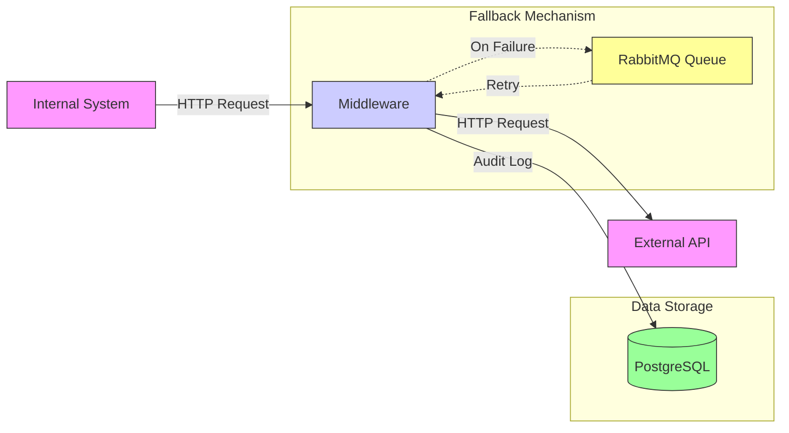
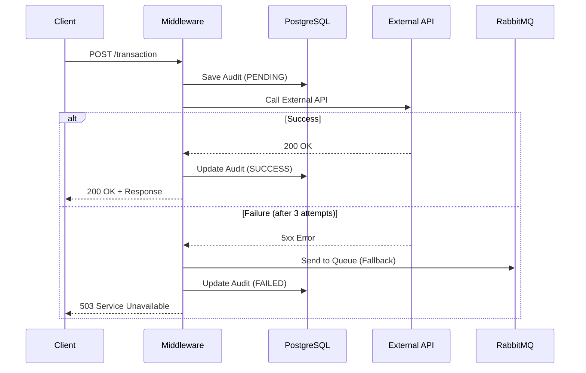

# Integration Middleware (API Connector)

## Project Overview

**Integration Middleware (API Connector)** is a reactive application built on **Spring Boot 3.5.8** using the **WebFlux** stack. It serves as an intermediary between internal systems and external APIs, ensuring robust communication with automatic retry mechanisms, fallback logic via RabbitMQ, and transaction audit logging in a database.

---

## Technology Stack

| Technology | Version | Description |
|------------|---------|-------------|
| **Java** | 21 | Programming Language |
| **Spring Boot** | 3.5.8 | Framework |
| **WebFlux** | - | Reactive Programming (Non-blocking I/O) |
| **Spring Security** | - | Security (API Key Authentication) |
| **R2DBC + PostgreSQL** | - | Reactive Database Access |
| **RabbitMQ** | 3.x | Message Broker for Fallback |
| **ShedLock** | 5.13.0 | Distributed Locking for Scheduled Tasks |
| **Prometheus + Grafana** | - | Monitoring and Visualization |
| **Lombok** | - | Boilerplate Code Reduction |
| **SpringDoc OpenAPI** | 2.8.15 | Swagger UI Documentation |
| **Maven** | - | Build Tool |
| **Docker** | - | Containerization |

---

## Architecture



The application acts as a central hub processing requests and managing failures gracefully.

---

## Project Structure

```
IntegracniMiddleware/
├── src/main/java/krematos/
│   ├── Main.java                          # Application Entry Point
│   ├── config/
│   │   ├── OpenApiConfig.java             # Swagger UI Logging
│   │   ├── RabbitMQConfig.java            # RabbitMQ Configuration
│   │   └── SchedulerConfig.java           # ShedLock Configuration
│   ├── connector/
│   │   ├── ExternalSystemConnector.java   # External API Client
│   │   └── externalApiException.java      # Custom Exception
│   ├── consumer/
│   │   └── FailedTransactionConsumer.java # Failed Transaction Processing
│   ├── controller/
│   │   ├── MiddlewareController.java      # REST API Endpoint
│   │   └── GlobalExceptionHandler.java    # Global Exception Handler
│   ├── model/
│   │   ├── InternalRequest.java           # DTO for Incoming Request
│   │   ├── InternalResponse.java          # DTO for Response
│   │   ├── ExternalApiRequest.java        # DTO for External API Request
│   │   ├── ExternalApiResponse.java       # DTO for External API Response
│   │   └── TransactionAudit.java          # Transaction Audit Entity
│   ├── repository/
│   │   └── TransactionRepository.java     # R2DBC Repository
│   ├── scheduler/
│   │   └── TransactionCleanupSchedular.java # Scheduled Cleanup Job
│   ├── security/
│   │   └── SecurityConfig.java            # Security Configuration
│   └── service/
│       └── TransactionService.java        # Main Business Logic
├── src/main/resources/
│   ├── application.yml                    # Application Configuration
│   └── schema.sql                         # Database Schema
├── Dockerfile                             # Docker Image Definition
├── docker-compose.yml                     # Multi-container Deployment
├── prometheus.yml                         # Prometheus Configuration
└── pom.xml                                # Maven Dependencies
```

---

## API Documentation

### Endpoint: Process Transaction

| Attribute | Value |
|-----------|-------|
| **URL** | `POST /api/middleware/v1/transaction` |
| **Content-Type** | `application/json` |
| **Authorization** | Header `X-API-KEY` |

#### Request Example

```json
{
  "internalOrderId": "ORD-2024-001",
  "amount": 1500.50,
  "currencyCode": "CZK",
  "serviceType": "PAYMENT",
  "requestedAt": "2024-01-15T10:30:00"
}
```

#### Request Fields

| Field | Type | Description |
|-------|------|-------------|
| `internalOrderId` | String | Unique Order ID |
| `amount` | BigDecimal | Transaction Amount |
| `currencyCode` | String | Currency Code (CZK, EUR, ...) |
| `serviceType` | String | Service/Product Type |
| `requestedAt` | LocalDateTime | Request Timestamp |

#### Responses

| Code | Description |
|------|-------------|
| `200` | Transaction processed successfully |
| `400` | Invalid data (Validation failed) |
| `403` | Invalid API Key |
| `503` | External system unavailable (Fallback active) |

---

## Security

The application uses **API Key Authentication**. Every request must include a valid key in the header:

```http
X-API-KEY: moje-tajne-heslo-12345
```

> ⚠️ **Important**: Change the default API key in production environment!

---

## Retry Mechanism

Middleware automatically retries requests upon External API failure:

| Parameter | Value | Description |
|-----------|-------|-------------|
| **Max Attempts** | 3 | Maximum number of retries |
| **Delay** | 1500 ms | Delay between attempts |
| **Retry On** | 500, 503, 504 | HTTP status codes triggering retry |

After all attempts are exhausted, the transaction is sent to the **RabbitMQ queue** `failed.transactions.exchange` for later processing.

---

## Database Schema

### Table `transaction_audit`

| Column | Type | Description |
|--------|------|-------------|
| `id` | SERIAL | Primary Key |
| `internal_order_id` | VARCHAR(255) | Order ID |
| `amount` | NUMERIC(19,2) | Amount |
| `currency` | VARCHAR(3) | Currency |
| `service_type` | VARCHAR(50) | Service Type |
| `status` | VARCHAR(50) | Status (PENDING/SUCCESS/FAILED) |
| `details` | TEXT | Result Details |
| `created_at` | TIMESTAMP | Creation Time |
| `updated_at` | TIMESTAMP | Update Time |

### Table `shedlock`

Table for distributed locking of scheduled tasks (ShedLock):

| Column | Type | Description |
|--------|------|-------------|
| `name` | VARCHAR(64) | Lock Name (PK) |
| `lock_until` | TIMESTAMP | Lock Expiration |
| `locked_at` | TIMESTAMP | Lock Creation Time |
| `locked_by` | VARCHAR(255) | Instance Identifier |

---

## Prerequisites

- **Java Development Kit (JDK)** 21
- **Maven** 3.x
- **Docker** and **Docker Compose** (for containerized environment)
- **PostgreSQL** 15+ (or via Docker)
- **RabbitMQ** 3.x (or via Docker)

---

## Installation and Execution

### Option 1: Local Development

1. **Clone the repository**
   ```bash
   git clone <repo-url>
   cd IntegracniMiddleware
   ```

2. **Build the project**
   ```bash
   mvn clean install
   ```

3. **Run the application**
   ```bash
   mvn spring-boot:run
   ```

### Option 2: Docker Compose (Recommended)

Start all services with a single command:

```bash
docker-compose up --build
```

This starts:

| Service | Port | URL |
|---------|------|-----|
| **Middleware** | 8080 | http://localhost:8080 |
| **RabbitMQ** | 5672, 15672 | http://localhost:15672 (Management UI) |
| **PostgreSQL** | 5432 | - |
| **Prometheus** | 9090 | http://localhost:9090 |
| **Grafana** | 3000 | http://localhost:3000 |

**Credentials:**

| Service | User | Password |
|---------|------|----------|
| RabbitMQ | `guest` | `guest` |
| Grafana | `admin` | `admin` |
| PostgreSQL | `Krematos_User` | `Krematos_Pass` |

---

## Monitoring

### Prometheus Metrics

The application exposes metrics at:

```
GET http://localhost:8080/actuator/prometheus
```

### Grafana

1. Login at http://localhost:3000
2. Add Prometheus as data source: `http://krematos-prometheus:9090`
3. Import or create dashboards

---

## Swagger UI (OpenAPI)

Interactive API documentation is available after startup:

```
http://localhost:8080/swagger-ui.html
```

---

## Transaction Processing Flow



---

## Configuration

Main configuration parameters (adjustable via `application.yml` or environment variables):

| Parameter | Default Value | Description |
|-----------|---------------|-------------|
| `server.port` | 8080 | Application Port |
| `external.api.base-url` | http://localhost:9090 | External API URL |
| `connector.retry.max-attempts` | 3 | Max Retry Attempts |
| `connector.retry.delay-ms` | 1500 | Delay between attempts (ms) |
| `api.security.key` | moje-tajne-heslo-12345 | API Key |

---

## Usage Examples

### cURL

```bash
curl -X POST http://localhost:8080/api/middleware/v1/transaction \
  -H "Content-Type: application/json" \
  -H "X-API-KEY: moje-tajne-heslo-12345" \
  -d '{
    "internalOrderId": "ORD-001",
    "amount": 999.99,
    "currencyCode": "CZK",
    "serviceType": "PAYMENT",
    "requestedAt": "2024-01-15T12:00:00"
  }'
```

### HTTPie

```bash
http POST localhost:8080/api/middleware/v1/transaction \
  X-API-KEY:moje-tajne-heslo-12345 \
  internalOrderId=ORD-001 \
  amount:=999.99 \
  currencyCode=CZK \
  serviceType=PAYMENT
```

---

## License

This project is created for educational purposes.

---

*Documentation generated: January 2026*
